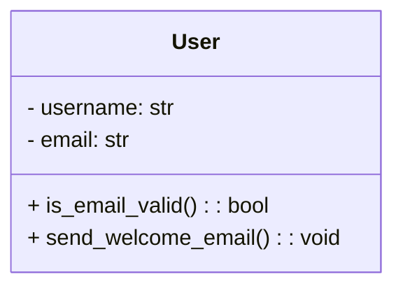

# Testing Strategies and Techniques

## Test Strategy Fundamentals

### What is a Testing Strategy?

A testing strategy is a high-level document that outlines how testing will be conducted across an organization or project. It includes:

- Types of testing to be performed (e.g., functional, non-functional)
- Choice between manual and automated testing
- Quality guidelines and objectives
- Example: Financial applications prioritize "security and regulatory compliance" in their strategy

### What are Testing Techniques?

Testing techniques are specific methods used to check different aspects of software:

- Verify functionality, performance, usability, and security
- Different approaches to testing implementation

Types include:

- Black-box testing (verifying external behavior without seeing code)
- White-box testing (analyzing internal logic with code access)
- Grey-box testing (combination of external and internal verification)

## Test Classifications and Levels

### Types of Testing

1. **Functional Testing**

   - Verifies software works according to specifications

2. **Non-functional Testing**

   - Performance
   - Security
   - UI/UX

3. **Structural Testing**

   - Based on internal logic and structure

4. **Change-related Testing**
   - Regression testing
   - Re-testing

### Testing Levels

| Level                    | Description                                                    |
| ------------------------ | -------------------------------------------------------------- |
| Unit Testing             | Testing individual functions/modules (e.g., JUnit, PyTest)     |
| Integration Testing      | Verifying module interactions and data flow between components |
| System Testing           | Testing complete application (functional + non-functional)     |
| Acceptance Testing (UAT) | User/client verification (including alpha/beta testing)        |

## Practical Testing Techniques

### 1. Boundary Value Analysis (BVA)

- Based on principle that bugs often occur at boundaries
- Based on principle that bugs often occur at boundaries
- Example 1: For input range 1-100, test 0,1,100,101
- Example 2: For a password length requirement of 8-16 characters, test:
  - 7 characters (just below minimum)
  - 8 characters (minimum boundary)
  - 16 characters (maximum boundary)
  - 17 characters (just above maximum)
- Efficiently detects edge cases with minimal test cases

### 2. Equivalence Partitioning

- Groups input values into clusters with expected similar behavior
- Tests representative values from valid clusters (e.g., 1-100)
- Tests invalid clusters (e.g., -1, 0, 101)
- Reduces test cases while maintaining coverage

### 3. Exploratory Testing

- Flexible testing without strict scripts
- Simultaneous learning and testing
- Effective for UI and complex user interactions
- Leverages creativity to find unexpected bugs

## Use Case-Based Testing

### What is a Use Case?

- User operation scenarios for software
- Typically includes:
  - Actor (who)
  - Scenario (steps)
  - Expected results

Example:

- E-commerce flow: "Add to cart → Complete purchase"

### UML Relationship

- UML use case diagrams visualize user-function relationships
- Testing techniques closely relate to use cases
- Creates realistic test scenarios

Example Application:

- Banking app "account transfer" use case
  - Functional test: Can transfers complete successfully?
  - Security test: Can third parties intercept data?

## Automated vs Manual Testing

| Method            | Characteristics                                                              |
| ----------------- | ---------------------------------------------------------------------------- |
| Manual Testing    | Human verification, strong in usability and exploratory testing              |
| Automated Testing | Script-based execution, suitable for regression testing and repetitive tasks |

## Key Takeaways

1. Test strategy provides overall direction, while techniques offer specific implementation methods
2. Testing occurs at multiple levels (unit → acceptance) for gradual quality verification
3. BVA and equivalence partitioning help efficient bug detection
4. Use cases enable testing in realistic scenarios
5. Proper combination of testing methods leads to:
   - Improved reliability
   - Higher user satisfaction
   - Cost reduction

# Practical Example: Unit Testing with Python

### Class Diagram



### Implementation Code

```python
# user.py
import re

class User:
    def __init__(self, username: str, email: str):
        self.username = username
        self.email = email

    def is_email_valid(self) -> bool:
        # Simple email format check
        return bool(re.match(r"[^@]+@[^@]+\.[^@]+", self.email))

    def send_welcome_email(self) -> None:
        print(f"Welcome, {self.username}! Email sent to {self.email}")
```

### Test Code with PyTest

```python
# test_user.py
import pytest
from user import User

def test_is_email_valid():
    user = User(username="alice", email="alice@example.com")
    assert user.is_email_valid() is True

def test_is_email_invalid():
    user = User(username="bob", email="bob#example.com")
    assert user.is_email_valid() is False

def test_send_welcome_email(capsys):
    user = User(username="carol", email="carol@example.com")
    user.send_welcome_email()
    captured = capsys.readouterr()
    assert "Welcome, carol!" in captured.out
```

### Test Cases Explanation

1. **Valid Email Test**

   - Tests that a correctly formatted email is validated
   - Uses boundary value analysis for a valid input

2. **Invalid Email Test**

   - Tests that an incorrectly formatted email is rejected
   - Example of negative testing

3. **Welcome Email Test**
   - Tests the output functionality
   - Uses PyTest's capsys fixture to capture stdout
   - Example of behavior verification
